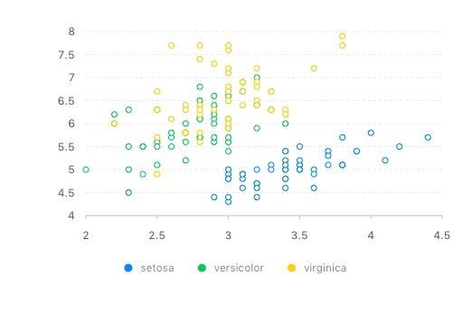

### using R6 for g2 R interface:

```r
library(rg2)

g2$new()$
  source(iris)$
  point()$
  position("Sepal.Width", "Sepal.Length")$
  color("Species")$
  render()
```



####facets
```r
g <- g2$new()
g$source(iris)
g$point()$
  position("Sepal.Length", "Sepal.Width")$
  color("Species")
g$facet("Species")
g$render()

```


```r
g <- g2$new()
g$source(iris)
g$point()$position("Sepal.Length", "Sepal.Width")$color("Species")
g$facet("Species", "tree")
g$render()
```

