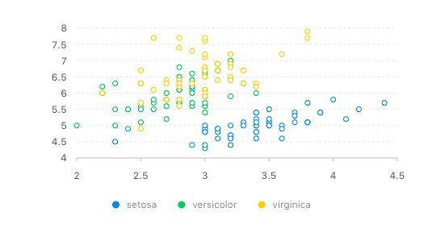
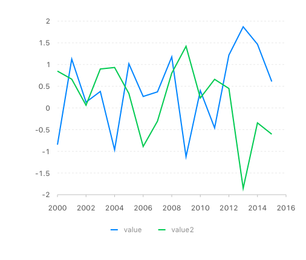

## g2 

#### conventions:

Pass data from R alongside the G2 javascript API. 
No need to initialise a new chart (configure via `g2_config`), source data, or render a chart. 

```r
rg2::g2(data = iris,
"
  chart
    .point()
    .position('Sepal.Width*Sepal.Length')
    .color('Species');
"
)
```


```r
df <- data.frame(date = 2000:2015, value = rnorm(16), value2 = rnorm(16))
df <- reshape2::melt(df, id = 'date')
rg2::g2(df, "chart.line().position('date*value').color('variable')")

```



